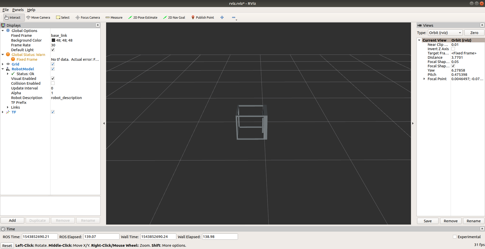
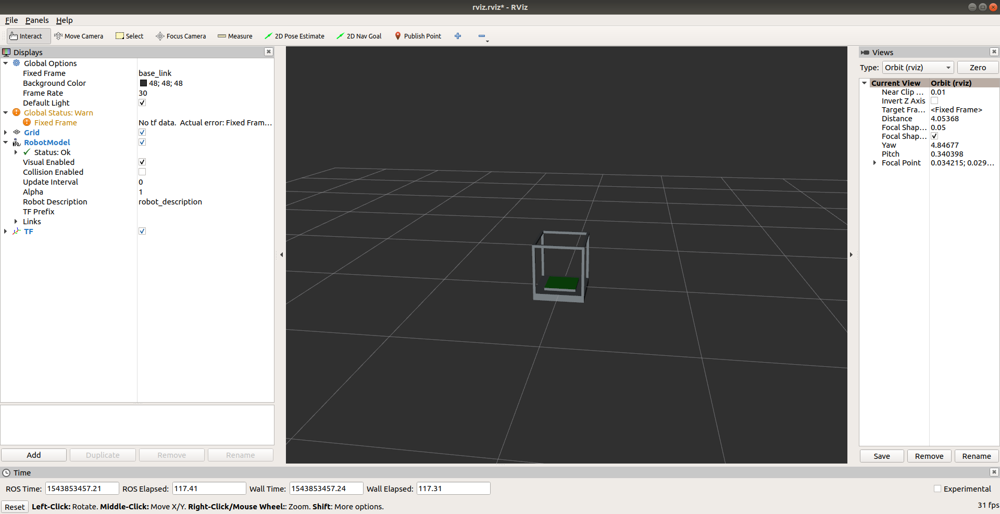
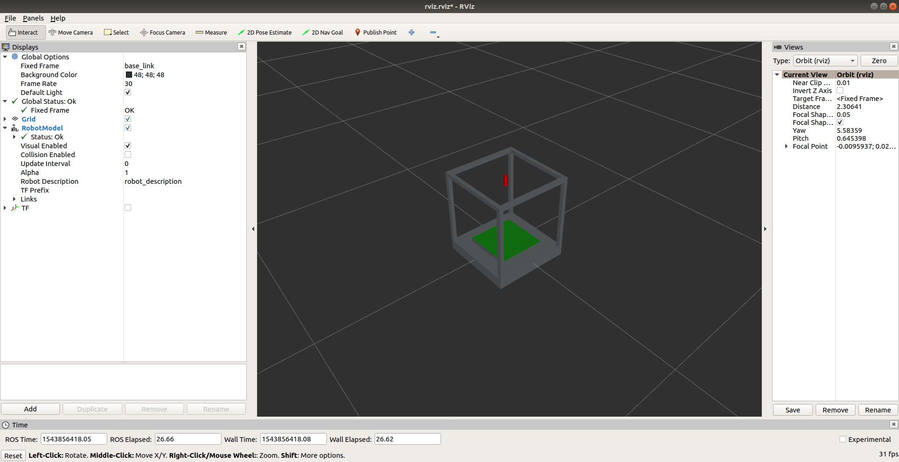
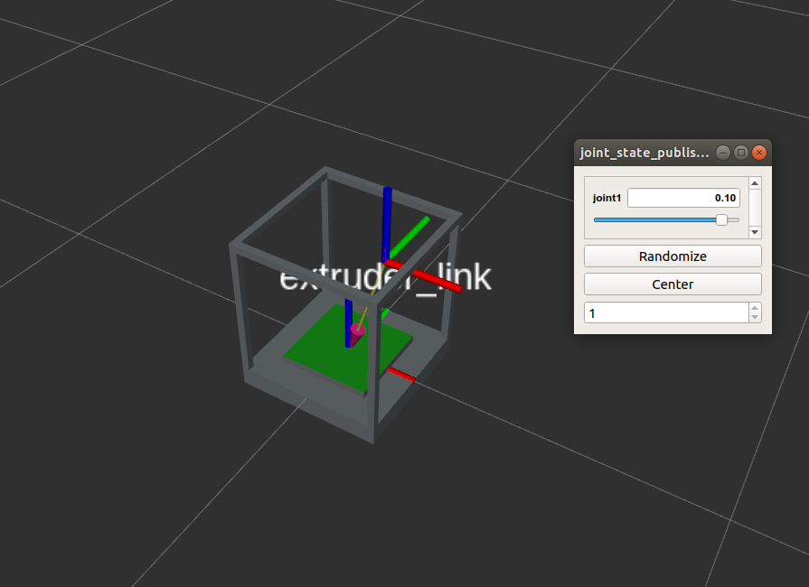

# Correction de l'examen Move 2017-2018
#### CPE Lyon

## Setup
- Initialize a workspace
- Clone the project in src folder

## Create first URDF
- Add printer.urdf with only one link to load the ```printer.dae``` file
- Add ```rviz.launch``` to preview your URDF
- Add ```RobotModel``` and ```TF``` in RVIZ
- Set Fixed frame to base_link
- Save RVIZ config to ```move_printer/config/rviz.rviz```
- Modify ```rviz.launch``` to have the saved config to be loaded by default by replacing the line
```xml
<node name="rviz" pkg="rviz" type="rviz" required="true" />``` by
```xml
<node name="rviz" pkg="rviz" type="rviz" args="-d '$(find move_printer)/config/rviz.rviz'" required="true" />```

#### At that point, you should have RVIZ running with the printer model loaded correctly with a wrong orientation



## Modify URDF

We are now going to turn the printer in the right direction. Let's put pi/2 in roll. We now have that result:



### We now want to add the extruder

- First add a new link named extruder_link
- By default, the TF is at the center of the cylinder, we move the origin of the cylinder half of its size on z axis to have it at the bottom of the cylinder
- Since we're using XACRO to parse our URDF, we can define variables to make our file cleaner. To do that:
  - Add the xmlns definition for xacro :
  ```xml
  Replace
  <robot name="printer">
    by
  <robot name="printer" xmlns:xacro="http://www.ros.org/wiki/xacro">```
  - Then define three variables right under of the ```<robot>``` tag :

    ```xml
    <xacro:property name="plate_height" value="0.025" />
    <xacro:property name="extruder_radius" value="0.01" />
    <xacro:property name="extruder_length" value="0.05" />```
- Now let's move the origin of the extruder_link to half of its size on z axis.
```xml
Replace
<origin rpy="0 0 0" xyz="0 0 0"/>
by
<origin rpy="0 0 0" xyz="0 0 ${extruder_length/2}"/>
```

#### At this point, we should have the TF at the bottom of the cylinder. We now need to set up a joint to be able to display the extruder

- Let's first add a new ```plate_length``` variable :
```xml
<xacro:property name="plate_length" value="0.25" />```
- Let's now add a first joint :
```xml
  <joint name="joint1" type="prismatic">
    <parent link="base_link"/>
    <child link="extruder_link"/>
    <origin rpy="0 0 0" xyz="0 0 0.35"/>
    <limit lower="${-plate_length/2}" upper="${plate_length/2}" effort="1000.0" velocity="0.1" />
  </joint>```
We're not specifying it here but by default if the ```<axis>``` tag is not defined, it assumes that the axis for this joint is the x axis. So we make sure to set the lower and upper limit to half of the plate length
- Let's save the file and run rviz again. Here is what we have :

We can also move the extruder along the x axis:

